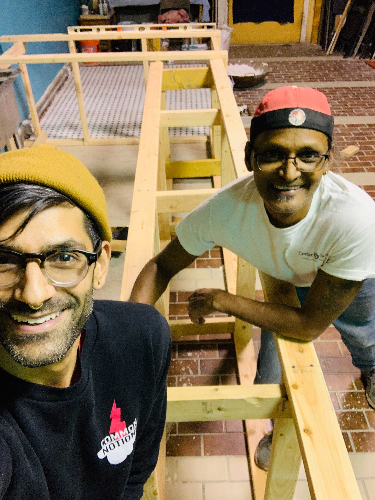
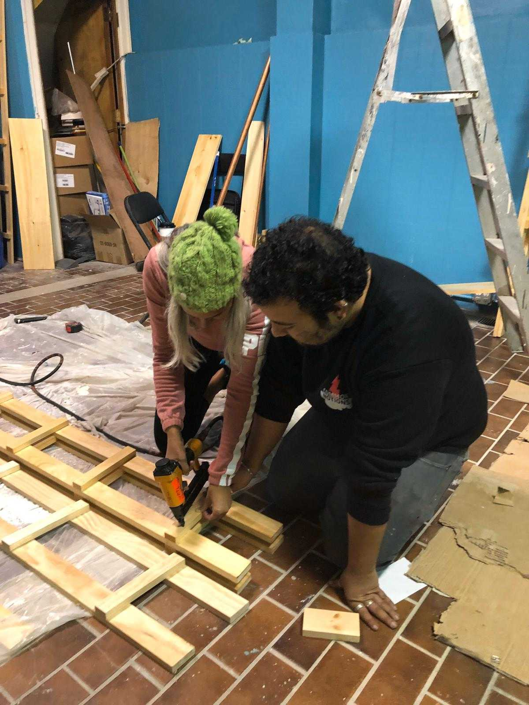

“Bookstores are magical spaces.” If what bookstore cofounder Malav Kanuga says is true (and we all know it is), then Making Worlds Bookstore & Social Center is an extra magical space.

<!-- end -->

That’s because Malav and the Making Worlds collective take that magic seriously. It’s visible in every decision they make as they transform a bookstore into a space to build a better world.

There’s magic in their vision. Magic in their West Philadelphia neighborhood. There’s even magic visible in how they approach the very model of the bookstore itself, from their collectively-run structure to how they’re turning to their community for financial support during the pandemic.

**Malav Kanuga and Jaskiran Dhillon, both collective stewards of the space, talked with us about the vision for the nonprofit bookstore and what the last year has been like.**

## A new generation bookstore

When Jaskiran recalled her relationship with bookstores, she thought about the tiny town of 418 people where she grew up on Treaty Six Cree Territory in Saskatchewan, Canada. She remembers entering a community bookstore, years later, being completely floored by the sheer amount of writing and knowledge jammed into one space. It felt like “a porthole to a whole other world of being, and thinking, and moving collectively.”

That experience shaped the vision for Making Worlds. While their core offering is books and literature, these resources are just one part of the larger movement-building journey they might facilitate for anyone who walks through their doors.

And then there’s the other half of Making Worlds: the Social Center.

According to Jaskiran and Malav, social connection is one of the most important things that happens in bookstores. Bookstores are spaces for intergenerational coming together. For strangers to meet. For new ideas to circulate. And for futures to be imagined. Jaskiran recalled visiting Rachna Books in India, and how it inspired Making Worlds:

> It was also a hub for training young people to be citizen journalists, to hold book talks, celebrate holidays and have birthdays. And when you’re
> sharing space in a city that’s rife with so many long standing social political issues, these spaces are essential.

In other words, a bookstore and a social space is a natural pairing that might spark one’s own revolutionary education. An education that includes connecting with new friends, deepening a commitment to liberation and justice, and building a movement that transforms lives.

“Imagine if that whole journey starts when you stumble into a poetry reading, or film screening, or while you’re sitting on a couch and pick up a book and overhear someone’s conversation,” described Malav. 

“Or the moment you see a cutie pie across the room.”

## Connecting West Philly with the world

On their opening weekend– just one month before lockdown began– Making Worlds celebrated with singing, readings, and a teach-in about an ongoing Indigenous struggle of the Wetʼsuwetʼen peoples in so-called Northern British Columbia. 

**“Having an internationalist orientation to this work matters even as you’re trying to be a neighborhood bookstore,” said Malav.**

They discussed the interconnectedness of political struggle and the need for genuine interpersonal and international solidarities; how this moment enabled Making Worlds to create a thread between Indigenous struggles in Northern British Columbia, Standing Rock, and Philadelphia. 

When asked about who makes up the Making Worlds community, Malav and Jaskiran talked about a variety of people in Philadelphia and beyond: Single moms with kids who need a break from the house. They talked about building relationships with young and older deeply-rooted Black and migrant communities  with longstanding ties in the neighborhood as well as many places around the world. They welcome the “bright eyed and bushy tailed college students of nearby Penn and Drexel to learn from the wealth of community knowledges that rarely find a home in university settings”. They talked about social justice-oriented artists, designers, woodworkers, and engineers from the community who helped  to build the space in the first place. They drew from a long list of friends, comrades, and fellow travelers in the city who are part of the communities in rebellion since the George Floyd protests: visionary organizers, journalists, scholars, young people who want a place to go after school together that isn’t policed.

So while much of the programming at the bookstore is designed for – and by – their neighbors, all teaching is foregrounded in what’s going on for Philadelphia and the world at large. 

"In order to be well, we need to learn about how all of us are doing and figure out how to take care of each other.  Whatever our situation is, knowing the larger backdrop helps us understand our own landscape," said Malav.

> It takes an enormous commitment to actually be with other people in all sorts of difficult ways, which is part of what our space which is *a* bookstore and is supposed to be-- more than a bookstore is trying to do.

## Financially pivoting in a pandemic without losing sight of who they are 

Recently, it’s this same community that’s helping to financially sustain Making Worlds. 

**As the pandemic closed their doors just one month after opening, they looked to funding strategies that matched the Making Worlds vision: something grassroots, collectively based, and grounded in relationships.**

Today, supporters will find the [Solidarity Fund](https://www.makingworldsbooks.org/solidarity-fund) on the [Making Worlds website](https://www.makingworldsbooks.org). They can [become a monthly sustainer through Withfriends](http://withfriends.co/making_worlds/join) or other giving platforms. Their publishing arm, [Common Notions](https://withfriends.co/common_notions/join), also continues to be a source of support and wider cultural production alongside the store itself.

Most recently, they’ve been brainstorming with Withfriends around how to give back to their sustainers. 

“The sense of shared value around this stuff is so, so helpful,” described Malav. “We don’t take it for granted at all. We don’t get that from other sustainer platform models like Patreon. It feels aligned in so many ways: learning how to navigate the world through deepening relationships with other people.”

## Questions? Let's get started!

If you have any questions about this article, we'd love to hear from you! Drop
us a line at team@withfriends.co, and while you're at it get started setting up
your own membership program. We'd love to hear what you think.
