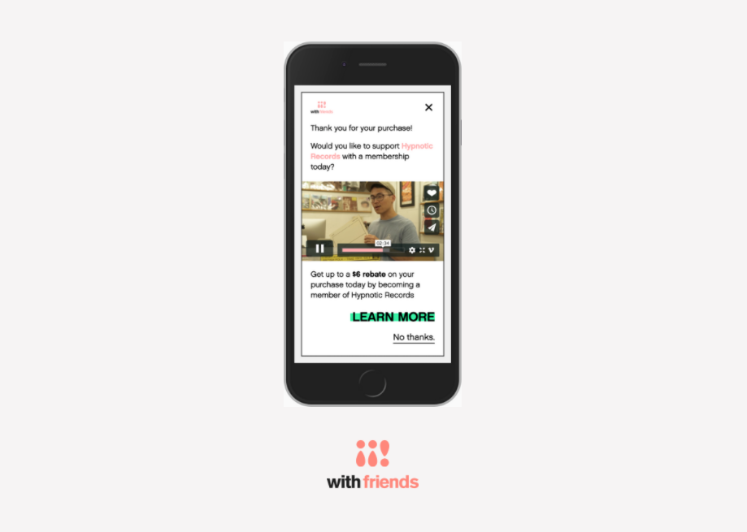
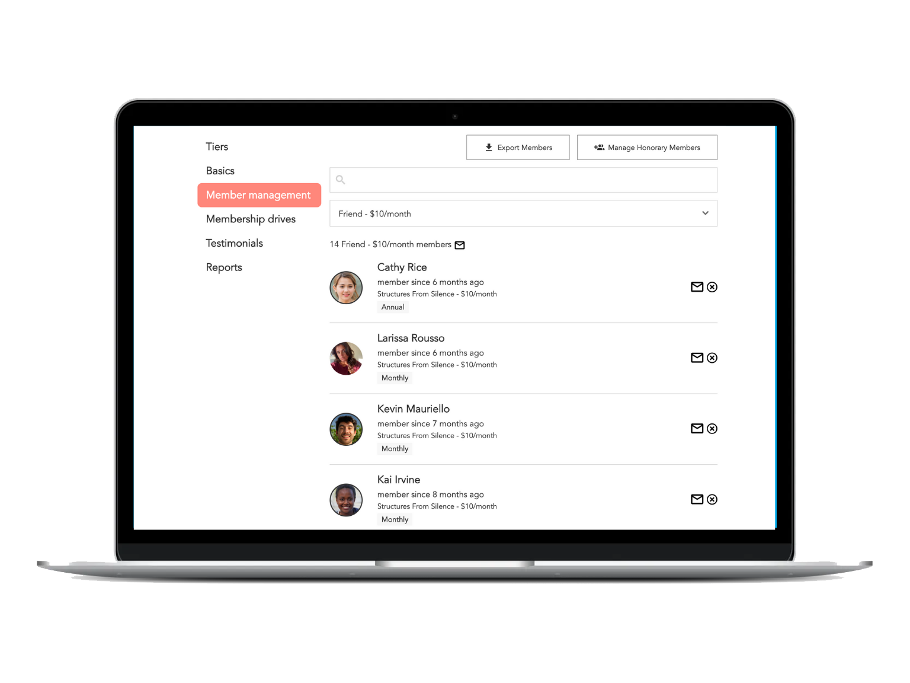

Learn how you can build a membership program that puts your business or
organization on the path to sustainability.

<!-- end -->

When most people think about membership programs, they think about nonprofits.
Every year, usually in December, they hear a radio pitch, or they get an
"urgent request" in their email inbox or — yes, even in 2020 — they find an
actual real-life letter asking them to "renew their membership," or for their
"continued support." These drives are make-or-break moments for many
organizations.

But look outside of the nonprofit world, and you'll find membership programs
that take far less work, while making up the vast majority of revenue in
certain sectors. CSAs are like membership programs for sustainable agriculture
from local farms. Locking yourself into a 6-month gym membership is one way to
ensure you'll take the time to get in shape.

## Pricing your memberships: the 20-70-140 rule

The first question people will have about your membership program is: How much
does it cost?

We've found that the most successful pricing is based on your business's
Average Order Value (AOV), which is the average amount that any customer spends
per visit to your business, whether online or in-person. We keep it simple with
three tiers, following the "20-70-140 rule," which we call Fan, Friend, and
Family:

- Fan: 20% of the AOV is like a "tip," showing they like what you do.
- Friend: 70% of the AOV is pretty close to what they probably just spent, and
  means they're a dedicated customer.
- Family: 140% of the AOV is something special. These are your biggest fans,
  and will not only become monthly members but will also probably increase
  their purchasing based on their membership.

**Most members on Withfriends stay members for two _years._ This means that even
a "Fan" membership is worth 350% of your AOV!**

### How to entice your customers to the higher tiers

When we ask members why they sign up for their memberships, they overwhelmingly
respond, "I want to support the business." But while supporting your business
might them to sign up at the "Fan" level, a well-crafted set of higher-priced
benefits can tip the scales toward those premium tiers.

Remember: a member at the "Friend" level is supporting your business at 350% of
the price of the "Fan" level.

Your "Friend" and "Family" tiers should have exclusive gifts and benefits that
remind your fans _why_ they're members. This means early access to your best
merch, discounts on package deals, and even quarterly or monthly deliveries of
products. (Consumable products like specialty foods and beverages are great for
these tiers.) Discounts are a huge motivator, but they don't have to break the
bank to be enticing.

**If you're worried about bad actors taking advantage of your membership program,
Withfriends provides a dashboard showing detailed discount usage reports to
ensure that you're making a profit on your memberships.**

## Announcing, asking, and communicating

Once you've built your membership program, it's time to tell the world. But
while it can be exciting at first, lots of membership programs fail because
they require too much upkeep. We've found that making it easy for a busy small
business owner to run a successful membership program requires three key
components: announcing, asking, and communicating.

### Announcing to all your members

A big announcement can mean a huge bump in your first-month's revenue. Because
of that it's important to consolidate all of your customer data, especially
email addresses, and send an announcement to your full mailing list. You might
want to also remind customers of something they recently purchased at your
business, especially if it has been a while, to ensure that they feel connected
to your product or organization.

We've found that a well-crafted announcement with a clear call-to-action can
convert anywhere from 2-7% of your past customers into members. That means that
if you have 1,000 customers over the last year, you could have 70 members
instantly, adding approximately \$1,500 monthly revenue for your business.

**Consolidating all your customer data can be complicated. Withfriends can
announce your new membership program to all your past customers from your
Shopify, Square, or Eventbrite store, automatically, with one click. (If you
don't have one of our supported platforms you can always upload a spreadsheet,
and we're adding new platforms all the time.)**

### Asking with an upsell

Membership programs that rely on real-life humans to do all the work are
extraordinarily difficult to maintain — let alone get off the ground. Yet, the
alternative that most websites reach for is often just a button or, worse, a
pop-up ad that interrupts an entirely different user flow.

It often seems like there are only two options: either sink a ton of time and
energy into your membership program, or passively wait for people to notice
you.

> Our solution is simple. Catch the customer when their wallet is already open,
> automatically.

Our solution is simple. Catch the customer when their wallet is already open,
automatically. It's important to tell your customers about your membership
program _every_ time they make a purchase, and to reach them however you can.
The most effective way to do this is by setting a custom "Thank You" page on
your online store, and redirecting to a membership upsell.

Finally, we've found that adding a rebate, even if it's just \$2, can be highly
motivating.

**At Withfriends, we've dedicated many hours to perfecting our Shopify, Square,
Eventbrite, and custom ticketing upsells, so that the customer sees a pitch for
a membership as soon as they complete checkout. We automatically calculate a
rebate based on a percentage of their most recent purchase, so that there's
never a rebate larger than the order itself.**

### Communicating with your members

Your members are not just passive — they're also your most dedicated customers!
Communicating with your members is important not just to reduce "churn," but
also to give you insights into what your most dedicated customers think about
your business.

> You have your very own focus group that allows you to stay in touch with
> those who care the most about your business and product.

Curious what new line of herbal tea blends to sell? Ask your members! With your
new membership program, you have your very own focus group that allows you to
stay in touch with those who care the most about your business and product.
This connection not only encourages your members to stick around, but it also
allows you to make your membership program and business as a whole more
attractive to future customers.

**Withfriends makes it easy to message members by tier, individually, or all at
once, to announce new products or remind them of benefits that they haven't
taken advantage of. We also automate this communication when you change certain
membership benefits, so you don't have to worry about ensuring your members
know about their latest membership program perks.**

## How the right membership software can help

Most people think of membership software as something that's in the background,
and that is only ever seen by the business or organization employees. We
believe that's misguided. As your most dedicated customers, your members are
actively invested in your business, and it's important to choose membership
software that's easy to use, not just for you but for your members as well!

We've found that, with our checkout upsell, an average of 5-7% of people
purchasing from your e-commerce site will become regular members. If you have
100 customers a month, that means you'll have, on average, 60 members by the
end of the year paying an average of \$22 every month. With this formula,
businesses can increase their revenue by 60% just by turning on memberships.

**Withfriends never charges you a monthly fee, so you'll never see a bill from
us. Instead, we receive 10% of your total membership revenue. This means that
our goal is to make _you_ the most revenue possible — when you succeed, we
succeed.**

## Questions? Let's get started!

If you have any questions about this article, we'd love to hear from you! Drop
us a line at team@withfriends.co, and while you're at it get started setting up
your own membership program. We'd love to hear what you think.
