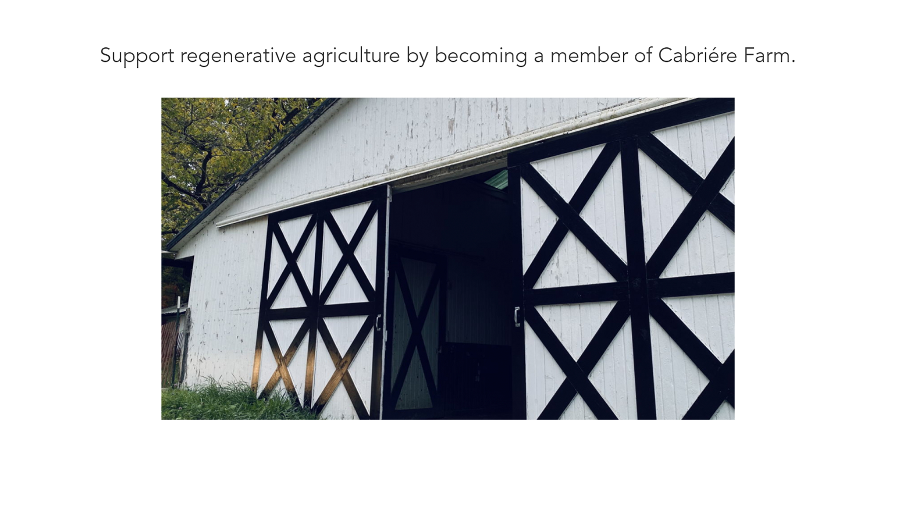
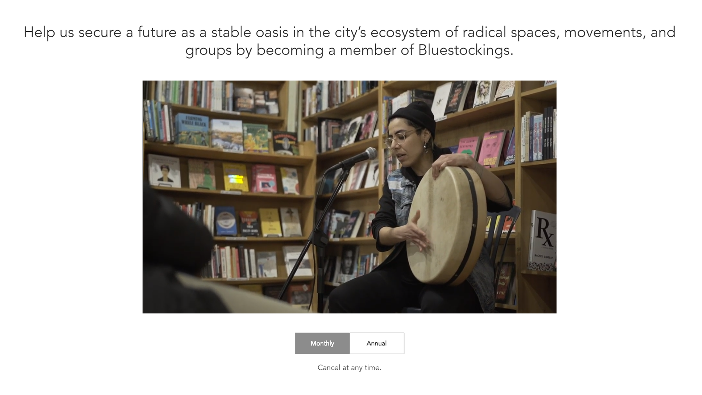
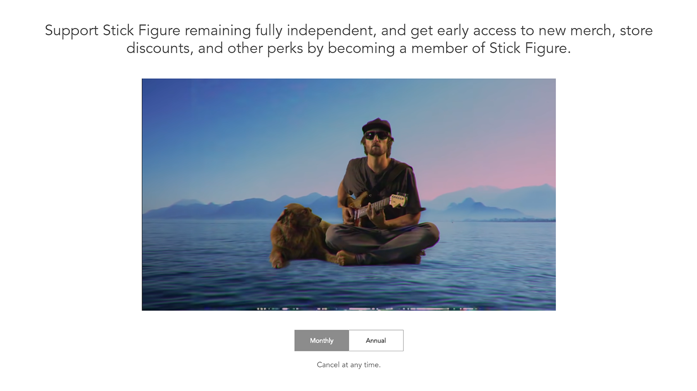

Most subscription services are purely transactional: you pay a flat fee, and
you receive some number of hand-selected clothes, or cosmetic samples, or
groceries for meals each week or month. It's rare that these businesses attempt
to convey a greater purpose. It's no surprise, then, that many subscription box
services face substantial churn rates. 

There are lots of ways that businesses have attempted to reduce these churn
rates, ranging from subscription "pauses" to a "free month on us." But what
about a solution that's free for the business, and that can inspire growth as
well as reduce churn?

Our theory at Withfriends is that your membership program needs a purpose. It's
not enough to just offer a subscription benefit — your members need to feel
like they are a part of a something.

What's more, stating your purpose loudly can give your members something to
share about why they became members — beyond the merch — leading to organic
growth from fan testimonials.

## How to write your membership program's purpose

Writing a purpose for your business and membership program might seem daunting,
but there's an easy way to approach it. It might seem sometimes like you're
just in it for the job, or that your customers are just in it for the deals,
but the reality is usually far more complicated. Why are your customers
visiting your store, on your platform, rather than ordering in a usually more
convenient fashion through an e-commerce giant like Amazon or Walmart?

You're a small business! You're not Amazon, or Walmart, and your customers know
that. They're supporting your business because of your product, yes, but
frequently also for the personalized connection you might bring to them.

There are three ways that we've seen how a well-crafted purpose can make a
different in turning your customers into recurring members.

- How are you changing the world for the better?
- How are you fighting an uphill battle? 
- How do your customers relate to you?

Let's go into each of these in-depth below.

### How are you changing the world for the better?

> *Support regenerative agriculture by becoming a member of Cabriére Farm.*

Cabriére Farm is a family owned farm in Columbus, Ohio, offering weekly premium
grocery deliveries to local customers. Yet, when you visit [their "Become a
Member" page](https://withfriends.co/cabriere_farm/join), what you see featured
first is not the product itself, but the purpose behind it. When you order a
weekly box of fresh veggies, you are helping the farm in "regenerating the land
through soil health, biodiversity and holistic methods."

When they first signed up, Cabriére Farm was primarily using Square to handle
online orders. But this meant that their customers had to re-order their
groceries every week. Now, through the Withfriends Square integration, everyone
who orders from their online store gets an "upsell" message to become a member.

### How are you fighting an uphill battle?

> *Help us secure a future as a stable oasis in the city’s ecosystem of radical
> spaces, movements, and groups by becoming a member of Bluestockings.*

Everyone loves an underdog, and Amazon has turned every bookstore in the
country into the biggest underdogs of all. [Bluestockings, a collectively run
and volunteer-powered bookstore in
NYC](https://withfriends.co/bluestockings/join), highlighted their uphill
battle and has raised thousands of dollars per month in memberships. At their
higher tiers, Bluestockings curates and ships a book straight to your doorstep,
reminding their members every month that they're supporting a cause that they
believe in.

Since the COVID pandemic began, Bluestockings has gone all-in on selling books
through their online store using the Square platform. Every customer who orders
a book online now gets an "upsell" message, and many of them sign up to become
members.

### How do your customers relate to you?

> *Support Stick Figure remaining fully independent, and get early access to
> new merch, store discounts, and other perks by becoming a member of Stick
> Figure.*

From the woods outside of Santa Cruz, California, the reggae artist Stick
Figure has built an enormous following through online releases and tours of
roots reggae festivals. His fans are dedicated to his music, and to their
connection to an independent performing artist. 

Because of this, many of his fans head to his Shopify store and purchase merch
— tank tops, t-shirts, and even Christmas ornaments — all branded with his
logo. It's a familiar story for many musicians, especially during the COVID
pandemic when tour-driven merch sales are slow.

As a result of stating a purpose that resonates with his fans, nearly 8% of
people who finish a purchase through his online Shopify store become monthly
members, subscribing at up to $30 per month for a t-shirt or other merch item
sent right to their door.

Stick Figure's fans are independent, free-thinkers, and highlighting that
commonality is highly effective at turning them from fans into members.

## Questions? Let's get started!

If you have any questions about this article, we'd love to hear from you! Drop
us a line at team@withfriends.co, and while you're at it get started setting up
your own membership program. We'd love to hear what you think.
