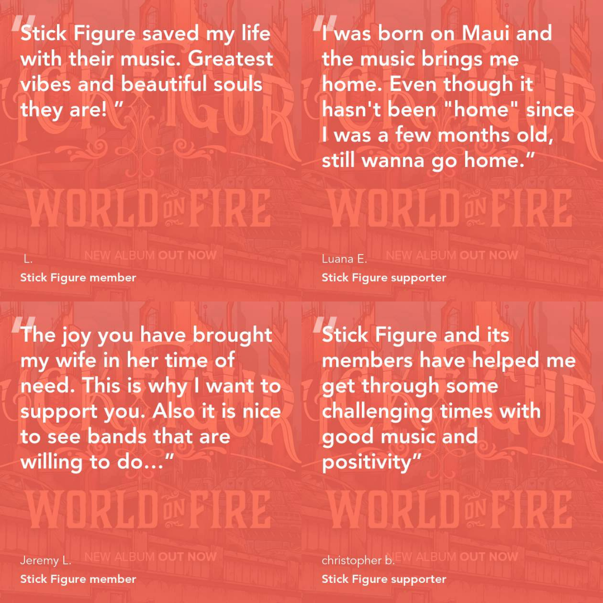

Read on to see how a reggae group based in the woods outside of Oakland, CA,
turned a successful merch store into a recurring revenue stream worth a
substantial amount. Stick Figure's average membership on Withfriends is 300% the
average Patreon donation.

<!-- end -->

## Turn your biggest fans into monthly paying members

Stick Figure, an independent reggae group, has been running a successful
merch store on Shopify, with fans all over the country buying t-shirts,
hoodies, and even Stick Figure-branded tiki mugs.

Withfriends makes it possible for Stick Figure to connect with their fan base
all over the country by selling memberships with every purchase on their merch
store. Using our Shopify integration to generate profitable pricing and
benefits for their **Stick Fam**, **On The List**, and **Band & Crew** tiers,
they launched a little over two months ago and their growth is surging!

## Give something to your fans and get support in return

Stick Figure gave something in return to their huge fan base, tripling their
average membership over what they would have earned on Patreon. This was
something they were already making, so it didn’t require any additional work.

Stick Figure integrated memberships into their core sales channel through
Shopify, ensuring that they would automatically be announced to the widest
number of fans. Because the store was already active and the integration is
automatic, this didn’t require any additional work either.

[Stick Figure chose a core purpose](/posts/purpose) that resonated with fans —
"Support Stick Figure remaining independent" — leading to a huge number of
testimonials that emphasize their selling point. This was more than just a
sale, it was an opportunity to connect more deeply with fans that resonated
with the band’s mission.

Stick Figure membership benefits include:

- Curated t-shirt box every month
- 10% discount on merch purchases
- Support Stick Figure remaining independent
- Early access to special merch drops

In two and a half months, Stick Figure has grown to 363 members!

As vital as this kind of revenue is for every small business, the most valuable
part is the deeper engagement it fosters with these members, represented by the
glowing testimonials left as they sign up, and shared online. Here’s a small
sample of the vibrancy of Stick Figure’s community!

**While the Stick Figure community is quite unique, with the tools Withfriends
offers you can start building your own membership community right now with your
existing customers.**

## Questions? Let's get started!

If you have any questions about this article, we'd love to hear from you! Drop
us a line at team@withfriends.co, and while you're at it get started setting up
your own membership program. We'd love to hear what you think.
