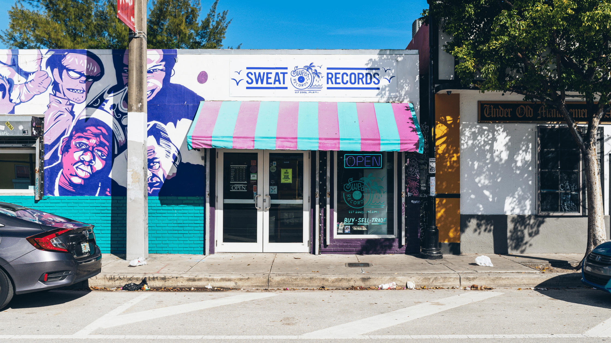

In 2005, [Sweat Records](https://sweatrecordsmiami.com/) opened in Miami as a homegrown hub for music lovers in South Florida and beyond. It’s a record store. A space for shows. A community partner. And it’s become an international, intergenerationally beloved institution.

<!-- end -->

“Over 16 years, we’ve had customers who have become friends, who have kids, and then come in with their kids,” said co-owner and founder Lolo Reskin. “We've gotten love letters in the mail from our patrons, people tagging us wearing sweatshirts all around the world, or someone texting about being in a bar in New York and seeing a Sweat Records sticker.”

That’s the Sweat Records effect: a global and hyperlocal community of supporters who have been buying vinyl, going to shows, and hanging out with their staff for sixteen years.

**“The fact that we get these generational visitors is incredible, and shows what longevity in this scene can do.”**

## Celebrating a 15 Year Anniversary in a Pandemic

As the COVID-19 pandemic forced thousands of small businesses to navigate online sales, Sweat Records was luckily ahead of the curve. They had been preparing to launch a webstore for the entirety of 2019 in celebration of their 15th anniversary.

In Lolo’s words? “It really saved our bacon.”

Operating a record store in an international, transient hub like Miami has attracted long-distance diehard fans of the store over the years. For the first time, Sweat was able to sell records and merch online to them. 

> “We see this store as an indie culture chamber of commerce,” said Lolo. “We’re in every travel guide in South Florida. Every guide to record stores around the world. Miami is also an incredibly transient city; people move away and come back. It’s a world in motion.” 

And for their supporters who want to give back, but don’t necessarily collect a ton of records, Withfriends opened up an easy alternative way to chip in.

## Bringing the In-Store Experience to Members

Members can [support Sweat Records through Withfriends](https://withfriends.co/sweat_records) at the ‘305 Represent’ level for $3.05 a month, or at the highest level of ‘Sweat Selects Vinyl Club Deluxe’ at $100 a month.

When designing perks for each level, the Sweat team brought the flavor of their in-store experience to members near and abroad.

> “Part of Sweat’s origin was to have a homegrown store that catered to music people in Miami listened to,” said Lolo. While Miami’s scene is often misunderstood as a musical monolith, the Sweat Records team understands the nuance of South Floridian tastes. They’re proud of their recommendations for being personal – and almost encyclopedic. The same is true for their suggestions of what to do around town. 

For example: Sweat staff are trained to ask visitors if it’s their first time in the store, and if they just moved to town. They might ask you about your hobbies. You like bikes? Oh, there’s Critical Mass on second Fridays. “The examples of how many people we’ve helped have a better life in Miami is innumerable,” said Lolo. She’s even met best friends and her partner this way.

For members at the top tier of their Withfriends membership, they get a taste of that through Sweat’s Record of the Month club. 

While Sweat gives recommendations to anyone who asks, these members receive curated picks that the staff thinks they’ll specifically like. (There might even be some light social media detective work that supports their selection.)

> “Our main competition is Amazon,” said Lolo. “As much as we wish it weren’t true, people reflexively order records on there even though Amazon doesn’t give a damn about them, and pack the records crappily. Our records are packed perfectly with notes and stickers and love.”

Even when vinyl sales were slower years ago, Sweat would hold a club night every Friday to make up for gaps in revenue. Withfriends is just one more alternative revenue stream that helps them during these uncertain times. 

**“It’s great to diversify the ways that people can support us.”**

## Questions? Let's get started!

If you have any questions about this article, we'd love to hear from you! Drop
us a line at team@withfriends.co, and while you're at it get started setting up
your own membership program. We'd love to hear what you think.
